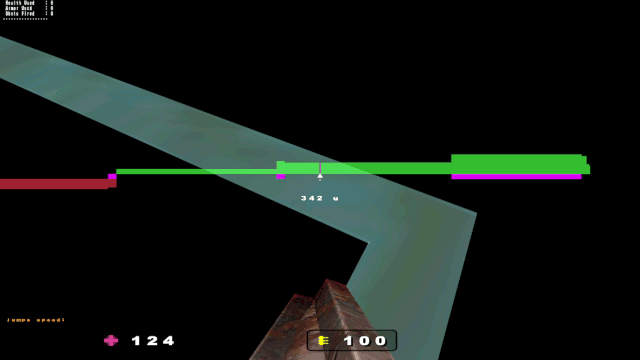

# AccelHud extension to Proxymod

Please note that the AccelHud is currently only pre-alpha version, might be buggy.

## Binaries:

|            | **Windows** | **Linux** | **macOS** |
| :--------: | :---------: | :-------: | :-------: |
| **32-bit** | [cgamex86.dll](../../releases/download/latest/cgamex86.dll) | [cgamei386.so](../../releases/download/latest/cgamei386.so) |
| **64-bit** | [cgamex86_64.dll](../../releases/download/latest/cgamex86_64.dll) | [cgamex86_64.so](../../releases/download/latest/cgamex86_64.so) | [cgamex86_64.dylib](../../releases/download/latest/cgamex86_64.dylib) |

## Build / Instalation

Follow instructions at [Jelvan1/cgame_proxymod](https://github.com/Jelvan1/cgame_proxymod) which is the original mod, this repository is only extention for it. Only exception is for macOS build, where you need *binutils* package, use `brew install binutils`, then provide path to the **objcopy** program installed with binutils, via cmake option `OBJCOPY_CMD` or argument `-DOBJCOPY_CMD=path/to/the/objcopy` (unless you add the binutils installation folder to environment variable PATH).

## Configuration options

`p_accel 0bXXXXXXXX`\
Xxxxxxxx - uniform acceleration value\
xXxxxxxx - draw condensed acceleration line\
xxXxxxxx - draw current acceleration line\
xxxXxxxx - draw vertical lines\
xxxxXxxx - disable drawing bars\
xxxxxXxx - draw line graph\
xxxxxxXx - highlight active zone\
xxxxxxxX - draw basic hud

`p_accel_trueness 0bXXXX`\
Xxxx - disable dynamic acceleration value correction\
xXxx - show true ground control zones\
xxXx - show true CPM air control zones\
xxxX - show true jump/crouch zones

`p_accel_min_speed X` - minimal speed in ups, which is required to draw hud

`p_accel_neg_mode X` - modes for showing negative acceleration

0 - disable negative acceleration\
1 - enable negative acceleration\
2 - show only adjecent negative acceleration

### Proportions:
`p_accel_yh X X`\
X x - y coord of hud center\
x X - height of hud (approximate)

`p_accel_line_size X` - size of line in line graph mode\
`p_accel_vline_size X` - size of vertical lines\
`p_accel_cond_size X` - size of condensed acceleration line\
`p_accel_p_offset X` - offset of predictions

Each value is relative to 640x480 resolution, scaled up to real resolution.

### Moves and predictions:
`p_accel_p_sm X` - while only sidemove (A or D key)\
`p_accel_p_fm X` - while only forwardmove (W key)\
`p_accel_p_nk X` - while no key pressed

0 - do not draw hud at all\
1 - draw normal\
2 - draw prediction of strafe/sidemove

`p_accel_p_strafe X` - while strafing (WA or WD keys) *only vq3*
`p_accel_p_opposite X` - the current move just on opposite side

0 - do not predict\
1 - do not predict\
2 - draw prediction of strafe/sidemove

### Colors:
`p_accel_rgba X X X X` - color of positive acceleration\
`p_accel_neg_rgba X X X X` - color of negative acceleration\
`p_accel_hl_rgba X X X X` - highlight color of positive acceleration\
`p_accel_hl_neg_rgba X X X X` - highlight color of negative acceleration\
`p_accel_cur_rgba X X X X` - color of line for current acceleration\
`p_accel_line_rgba X X X X` - color of positive line when in line graph mode\
`p_accel_line_neg_rgba X X X X` - color of negative line when in line graph mode\
`p_accel_line_hl_rgba X X X X` - highlight color of positive line when in line graph mode\
`p_accel_line_hl_neg_rgba X X X X` - highlight color of negative line when in line graph mode\
`p_accel_vline_rgba X X X X` - custom color for vertical lines\
`p_accel_zero_rgba X X X X` - color of zero acceleration in condensed acceleration line

Colors order is: Red Green Blue Alpha, each as value between 0 and 1.\
For example: `p_accel_rgba .2 .9 .2 .6`.

### Color modificators:
`p_accel_p_strafe_rgbam X X X X` - color modificator for predicting strafe
`p_accel_p_sm_rgbam X X X X` - color modificator for predicting sidemove
`p_accel_p_opposite_rgbam X X X X` - color modificator for predicting opposite side

Values can range from -1 to 1, for example `p_accel_predict_add_rgba -.2 -.1 .2 -.2` would make of
`p_accel_rgba .2 .9 .2 .6` new color: `0 .8 .4 .4`.

You can use accelhud.cfg as default config, copy that file into your /defrag folder, then add `exec accelhud.cfg` into your autoexec.cfg.
\
\
\
That's it, I hope someone finds this useful.
